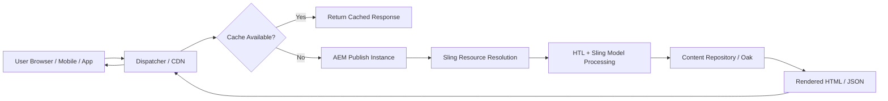
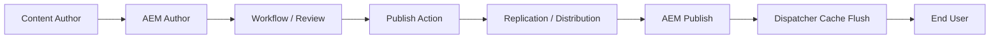

# AEM Architecture Flow

This section explains the complete AEM architecture from user request to final rendered response.

## End-to-End Request Flow

```mermaid
flowchart LR
    A[User Browser / Mobile / App] --> B[Dispatcher / CDN]
    B --> C{Cache Available?}
    C -- Yes --> D[Return Cached Response]
    C -- No --> E[AEM Publish Instance]
    E --> F[Sling Resource Resolution]
    F --> G[HTL + Sling Model Processing]
    G --> H[Content Repository / Oak]
    H --> I[Rendered HTML / JSON]
    I --> B
    B --> A
```

## Author to Publish Flow

```mermaid
flowchart LR
    A[Content Author] --> B[AEM Author]
    B --> C[Workflow / Review]
    C --> D[Publish Action]
    D --> E[Replication / Distribution]
    E --> F[AEM Publish]
    F --> G[Dispatcher Cache Flush]
    G --> H[End User]
```
