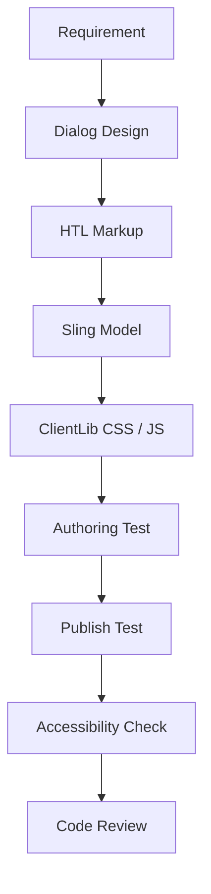

# AEM Component Development

Generic AEM component examples using HTL, Sling Models, Dialog XML, ClientLibs, and content structure.

## Included Components
- Page Title Component
- Sub Heading Component
- Tabs Component
- Grid Component
- CTA Button Component
- Dynamic Table Component

