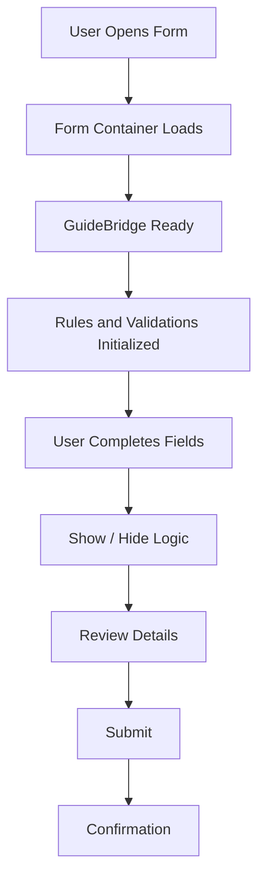

# Adaptive Forms Framework

Generic Adaptive Forms examples for enterprise form journeys.

## Concepts Covered
- Form container structure
- Field validation
- Rule Editor patterns
- Conditional show/hide logic
- GuideBridge usage
- Submit and review flow

