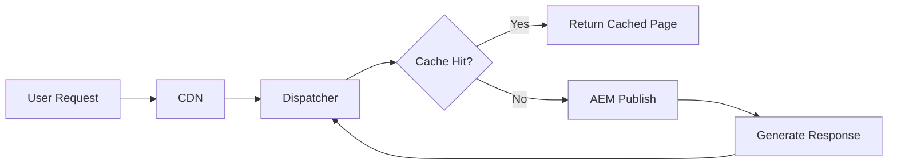

# Dispatcher Caching

Dispatcher caching, filters, invalidation, and routing.

```mermaid
flowchart LR
    A[User Request] --> B[CDN]
    B --> C[Dispatcher]
    C --> D{Cache Hit?}
    D -- Yes --> E[Return Cached Page]
    D -- No --> F[AEM Publish]
    F --> G[Generate Response]
    G --> C
```
