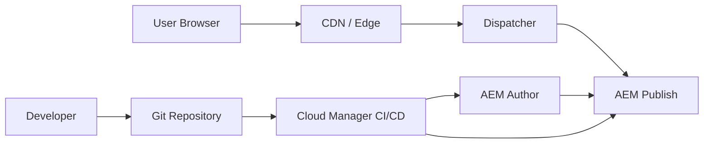

# AEM Enterprise Portfolio - Full Code Showcase

A generic, industry-neutral Adobe Experience Manager portfolio repository showcasing enterprise AEM component development, Sling Models, implementation classes, HTL, authoring dialogs, ClientLibs, Adaptive Forms patterns, Dispatcher, Cloud Manager CI/CD, accessibility, security, and governance documentation.

> Educational portfolio project only. This repository does not contain client, employer, proprietary, production, or confidential code.

## What This Repository Demonstrates

- AEM Maven multi-module style structure
- Components under `ui.apps/src/main/content/jcr_root/apps/enterprise-showcase/components`
- Dialog XML under `cq:dialog/.content.xml`
- Component metadata under `.content.xml`
- HTL templates for each component
- Java interfaces and implementation classes under `core`
- ClientLib CSS and JS examples
- Mock service and servlet examples
- Dispatcher filter/cache/vhost examples
- Adaptive Forms patterns and rule examples
- Accessibility and security notes
- LinkedIn-ready project summary

## Component Coverage

| Component | HTL | cq:dialog | .content.xml | JS | CSS | Java Interface | Java Impl |
|---|---:|---:|---:|---:|---:|---:|---:|
| Page Title | Yes | Yes | Yes | Yes | Yes | Yes | Yes |
| Subheading | Yes | Yes | Yes | Yes | Yes | Yes | Yes |
| CTA Button | Yes | Yes | Yes | Yes | Yes | Yes | Yes |
| Tabs V1 | Yes | Yes | Yes | Yes | Yes | Yes | Yes |
| Grid V1 | Yes | Yes | Yes | Yes | Yes | Yes | Yes |
| Dynamic Table | Yes | Yes | Yes | Yes | Yes | Yes | Yes |
| Modal | Yes | Yes | Yes | Yes | Yes | Yes | Yes |
| Adaptive Form Button | Yes | Yes | Yes | Yes | Yes | Yes | Yes |
| Radio Slider | Yes | Yes | Yes | Yes | Yes | Yes | Yes |
| Number Slider | Yes | Yes | Yes | Yes | Yes | Yes | Yes |

## Repository Structure

```text
core/                    Java interfaces, Sling Model implementations, services, servlets
ui.apps/                 AEM components, dialogs, templates, clientlibs
ui.content/              Sample content structure and demo page content
ui.frontend/             Frontend tokens and utility CSS/JS
dispatcher/              Dispatcher filters, cache, vhost examples
docs/                    Architecture, CI/CD, Forms, Accessibility, Governance
diagrams/                Mermaid diagrams
mock-api/                Generic JSON responses
linkedin/                LinkedIn post draft
pom.xml                  Parent Maven POM placeholder
```

## Architecture Overview



## How to Review

1. Start with this README.
2. Review components in `ui.apps/src/main/content/jcr_root/apps/enterprise-showcase/components`.
3. Review Sling Models in `core/src/main/java/com/example/aem/portfolio/core/models`.
4. Review model implementations in `core/src/main/java/com/example/aem/portfolio/core/models/impl`.
5. Review Dispatcher examples under `dispatcher/src/conf.dispatcher.d`.
6. Review LinkedIn draft under `linkedin/linkedin-post.md`.

## Important Notes

This is a portfolio reference, not a production-ready AEM archetype. Real enterprise projects require project-specific dependencies, content policies, templates, editable templates, OSGi configs, code quality gates, environment variables, and security approvals.
