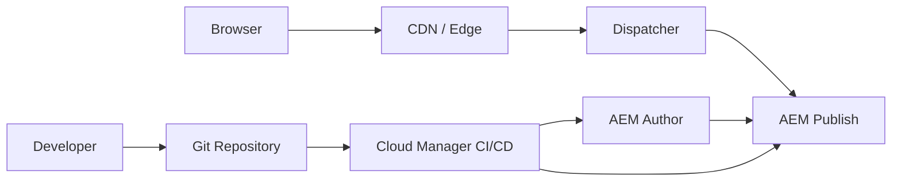

# AEM Enterprise Portfolio - Final Full Code Version

A generic, industry-neutral Adobe Experience Manager portfolio repository with a realistic AEM Maven-style structure, component source code, Sling Models, dialogs, HTL, client libraries, Dispatcher examples, documentation, mock APIs, and LinkedIn-ready content.

> Educational portfolio reference only. No client, employer, confidential, or proprietary code is included.

## Skills Demonstrated

- AEM as a Cloud Service project structure
- HTL component development
- Coral UI `cq:dialog` authoring dialogs
- Sling Model interfaces and implementation classes
- JSON exporter pattern using `ComponentExporter`
- ClientLib JavaScript and CSS
- Dispatcher filter/cache/vhost examples
- Cloud Manager CI/CD documentation
- Adaptive Forms interaction patterns
- Accessibility and security governance

## Repository Structure

```text
core/                    Java interfaces, Sling Model impls, services, servlets
ui.apps/                 AEM components, dialogs, HTL, clientlibs
ui.content/              Sample content root
ui.frontend/             Frontend utility placeholder
dispatcher/              Dispatcher farm/filter/vhost examples
docs/                    Architecture and governance documentation
diagrams/                Mermaid diagrams
mock-api/                Generic JSON responses
linkedin/                LinkedIn post draft
pom.xml                  Parent Maven POM
```

## Components Included

- Page Title
- Subheading
- Tabs V1
- Grid V1
- Dynamic Table
- CTA Button
- Modal
- Adaptive Form Button
- Radio Slider
- Number Slider

All components include:

```text
.content.xml
cq:dialog/.content.xml
component HTL file
component clientlibs CSS/JS
Sling Model interface
Sling Model Impl class
README.md
```

## Architecture Overview



## Important Note

This project is intended for portfolio, learning, and interview discussion. It is not intended to be deployed into production without project-specific adjustments, testing, dependency alignment, and package configuration.
