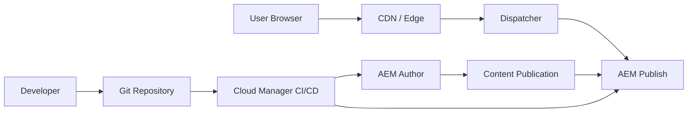

# AEM Enterprise Portfolio Complete

A generic, industry-neutral Adobe Experience Manager portfolio repository showcasing enterprise AEM architecture, component development, Adaptive Forms concepts, Dispatcher caching, Cloud Manager CI/CD, accessibility, security, and content governance.

> This repository is an educational and portfolio-focused reference implementation. It does not contain client, employer, proprietary, production, or confidential code.

## What This Portfolio Demonstrates

- AEM Maven project-style structure
- Components under `ui.apps/src/main/content/jcr_root/apps/.../components`
- Sling Models under `core/src/main/java`
- Dialog XML examples
- HTL component examples
- ClientLib CSS/JS examples
- Adaptive Forms concepts and rule patterns
- Dispatcher configuration examples
- Cloud Manager CI/CD documentation
- Security and accessibility checklists
- Enterprise authoring and release governance
- LinkedIn-ready project summary

## Repository Structure

```text
core/                    Java Sling Models, services, servlets
ui.apps/                 AEM components, dialogs, templates, clientlibs
ui.content/              Sample content structure and demo pages
ui.frontend/             Frontend tokens and utilities
dispatcher/              Dispatcher filters, cache, vhost examples
docs/                    Architecture, forms, CI/CD, governance documentation
diagrams/                Mermaid architecture diagrams
mock-api/                Generic mock JSON responses
linkedin/                LinkedIn post drafts
pom.xml                  Parent Maven POM placeholder
```

## Included Components

| Component | Purpose |
|---|---|
| Page Title | Generic heading component with alignment and subtitle support |
| Subheading | Section heading with optional center alignment |
| Tabs V1 | Default and pills tab variants |
| Grid V1 | Responsive layout wrapper with spacing options |
| Dynamic Table | Generic row/column table rendering pattern |
| CTA Button | Reusable call-to-action button |
| Modal | Generic dialog/modal component |
| Adaptive Form Button | Form action button pattern |
| Radio Slider | Radio-based slider UI pattern |
| Number Slider | Numeric slider with reset state pattern |

## Architecture Overview



## How to Use This Repository

1. Review the root README.
2. Open `docs/architecture/enterprise-aem-architecture.md`.
3. Review components under `ui.apps/src/main/content/jcr_root/apps/enterprise-showcase/components`.
4. Review Java models under `core/src/main/java/com/example/aem/portfolio/core/models`.
5. Review Dispatcher examples under `dispatcher/src/conf.dispatcher.d`.
6. Use `linkedin/linkedin-post.md` when ready to share.

## Important Notes

This is not intended to be deployed directly to a production AEM environment without project-specific adjustments. It is designed to demonstrate structure, thinking, and implementation patterns for portfolio and interview discussions.
