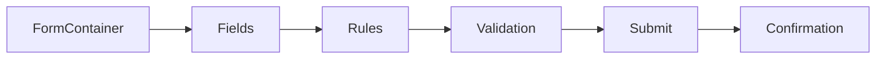

# Adaptive Forms Framework

This section documents generic Adaptive Forms concepts without using any client-specific implementation.

## Concepts Covered

- Form container categories
- GuideBridge initialization
- Rule Editor show/hide logic
- Client-side validation
- Submit action pattern
- Multi-step journey design

## Example Rule Pattern

- Show a section when a selected value equals a configured condition.
- Hide optional fields until required by user input.
- Validate phone, email, and date fields using reusable validation utilities.
