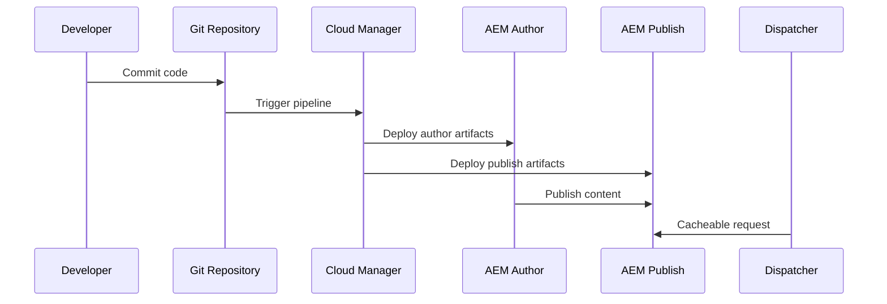

# Enterprise AEM Architecture

This document explains a generic AEM architecture covering Author, Publish, Dispatcher, CDN, Git, Cloud Manager, and content governance.

```mermaid
sequenceDiagram
    participant Dev as Developer
    participant Git as Git Repository
    participant CM as Cloud Manager
    participant Author as AEM Author
    participant Publish as AEM Publish
    participant Dispatcher as Dispatcher
    Dev->>Git: Commit code
    Git->>CM: Trigger pipeline
    CM->>Author: Deploy author artifacts
    CM->>Publish: Deploy publish artifacts
    Author->>Publish: Publish content
    Dispatcher->>Publish: Cacheable request
```
