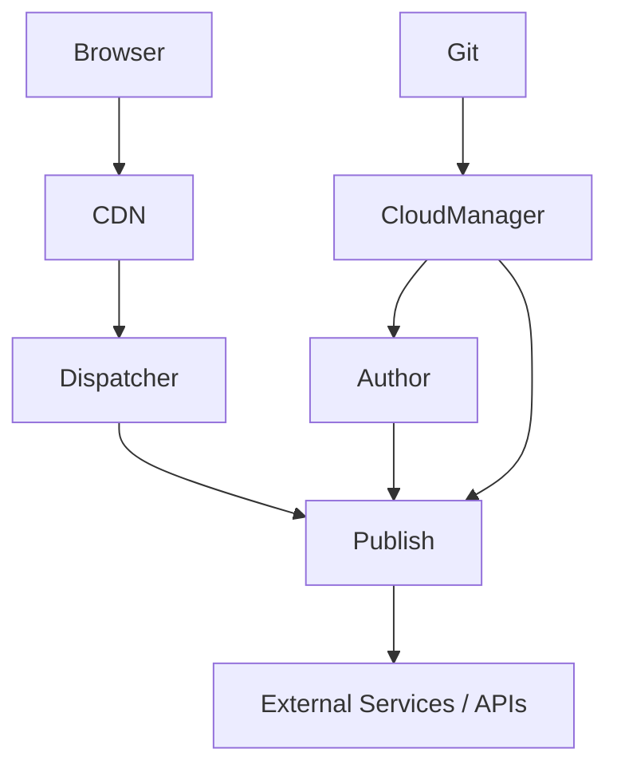

# Enterprise AEM Architecture

This document explains a generic AEM enterprise architecture suitable for multiple industries.

## Core Layers

1. Browser / client application
2. CDN or edge layer
3. Dispatcher
4. AEM Publish
5. AEM Author
6. Cloud Manager CI/CD
7. Git repository
8. Integration and service layer

## Key Responsibilities

- Author is used for content creation and component configuration.
- Publish serves approved content to customers.
- Dispatcher caches and filters requests.
- Cloud Manager deploys code and configuration.
- Git maintains version-controlled implementation.
