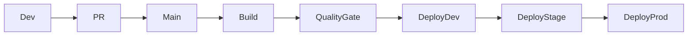

# Cloud Manager CI/CD Flow

## Flow

1. Developer commits code.
2. Pull request is reviewed.
3. Main branch triggers pipeline.
4. Build and quality gates run.
5. Artifact is deployed to lower environment.
6. Functional validation is completed.
7. Promotion is approved.

