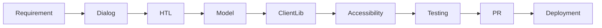

# AEM Component Development Lifecycle

## Steps

1. Understand authoring requirement.
2. Create or update component dialog.
3. Implement HTL markup.
4. Add Sling Model for backend logic.
5. Add ClientLib CSS/JS if needed.
6. Add accessibility attributes.
7. Test author, preview, and publish behavior.
8. Raise pull request.
9. Validate in lower environments.

