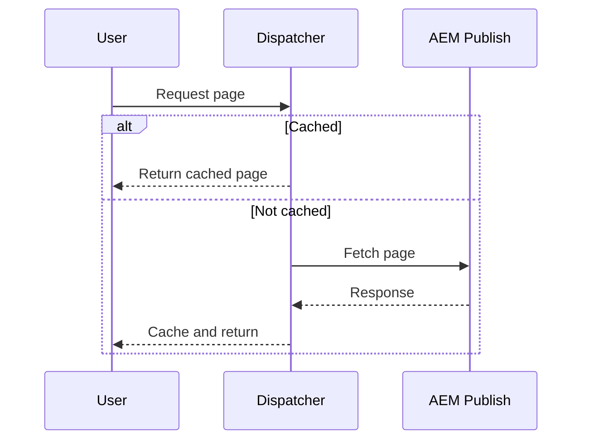

# Dispatcher Caching and Filters

Dispatcher improves performance and protects publish instances.

## Responsibilities

- Cache static and HTML content.
- Block sensitive paths.
- Allow only required content and clientlib paths.
- Invalidate cache after content activation.

