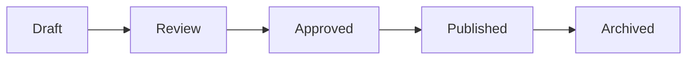

# Enterprise Content Lifecycle

## Governance Rules

- Draft content is created by authors.
- Review content is validated by content owners.
- Approved content is published through controlled workflows.
- Rollback is handled through versioning or package restoration.
